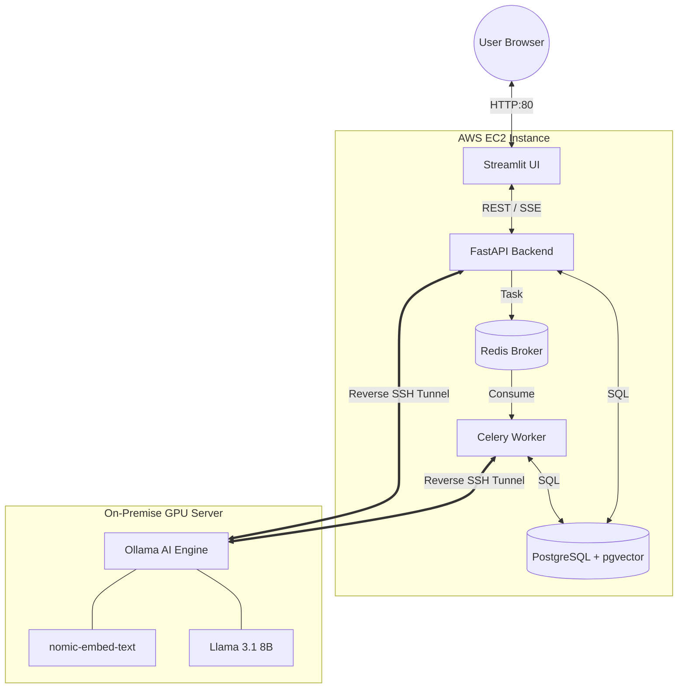

# DocuMind 🧠

DocuMind is an advanced Multimodal Retrieval-Augmented Generation (RAG) engine built for secure, local, and cloud-hybrid document chat. It allows you to upload personal documents (PDFs, TXTs) and chat intelligently with them using state-of-the-art open-source LLMs like Llama 3.1.

## Features
* **Multi-Tenant Security:** Secure JWT authentication and bcrypt password hashing. User data and chat histories are strictly isolated.
* **Cascading Data Deletion:** Full control over your privacy. Deleting your account automatically purges all your documents, vector embeddings, and chat histories from the database.
* **Advanced Document Management:** A centralized Knowledge Base to view and selectively delete uploaded documents.
* **Real-time Streaming:** Token-by-token streaming responses for a ChatGPT-like experience. Includes graceful mid-stream interruption handling.
* **Intelligent Search:** Powered by `pgvector` for rapid cosine-similarity semantic search across document chunks.

## Tech Stack
* **Frontend:** Streamlit
* **Backend:** FastAPI, Python 3.11
* **Database:** PostgreSQL (with `pgvector` extension)
* **Task Queue:** Celery & Redis
* **AI Engine:** Ollama (Llama 3.1 8B, Nomic-Embed-Text)

## Architecture

## Screenshots

*(Add your screenshots here by replacing the placeholder links)*

### 1. Chat Interface

### 2. Knowledge Base & Uploads

### 3. Login / Registration

