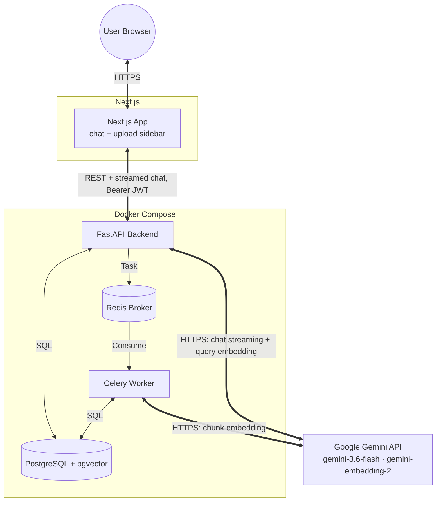

# DocuMind 🧠

DocuMind is an advanced Multimodal Retrieval-Augmented Generation (RAG) engine built for secure, multi-tenant document chat. It allows you to upload personal documents (PDFs, TXTs) and chat intelligently with them, powered by the Google Gemini API.

## Features
* **Multi-Tenant Security:** Secure JWT authentication and bcrypt password hashing. User data and chat histories are strictly isolated.
* **Cascading Data Deletion:** Full control over your privacy. Deleting your account automatically purges all your documents, vector embeddings, and chat histories from the database.
* **Advanced Document Management:** A centralized Knowledge Base to view and selectively delete uploaded documents.
* **Real-time Streaming:** Token-by-token streaming responses for a ChatGPT-like experience. Includes graceful mid-stream interruption handling.
* **Intelligent Search:** Powered by `pgvector` for rapid cosine-similarity semantic search across document chunks.

## Tech Stack
* **Frontend:** Next.js 16 (App Router) · TypeScript · Tailwind CSS — in `frontend/`
* **Backend:** FastAPI, Python 3.11
* **Database:** PostgreSQL (with `pgvector` extension)
* **Task Queue:** Celery & Redis
* **AI Provider:** Google Gemini API via the `google-genai` SDK — `gemini-3.6-flash` (chat), `gemini-embedding-2` (768-dim embeddings)

> `ui/` contains the original Streamlit prototype, kept for reference. The Next.js app in `frontend/` is the current UI.

## Configuration

**Backend** — copy `.env.example` to `.env` and fill in:

| Variable | Purpose | Default |
| --- | --- | --- |
| `GEMINI_API_KEY` | Google Gemini API key (required, used by API + Worker) | — |
| `CHAT_MODEL` | Gemini chat model | `gemini-3.6-flash` |
| `EMBEDDING_MODEL` | Gemini embedding model | `gemini-embedding-2` |
| `SECRET_KEY` | JWT signing key | dev fallback |
| `FRONTEND_ORIGINS` | CORS allow-list for the browser app (comma-separated, or `*`) | `http://localhost:3000,http://localhost:3001` |

**Frontend** — `frontend/.env.local`:

| Variable | Purpose | Default |
| --- | --- | --- |
| `NEXT_PUBLIC_API_URL` | Base URL of the FastAPI backend | `http://localhost:8000` |

`.env` and `.env*.local` are git-ignored; commit only the `.example` templates.

## Running locally

```bash
# 1. Backend (API, Worker, Redis, Postgres)
docker compose up -d --build          # API on http://localhost:8000

# 2. Frontend
cd frontend
npm install
npm run dev                           # app on http://localhost:3000
```

## Architecture



## Screenshots

*(Add your screenshots here by replacing the placeholder links)*

### 1. Chat Interface


### 2. Knowledge Base & Uploads


### 3. Login / Registration

