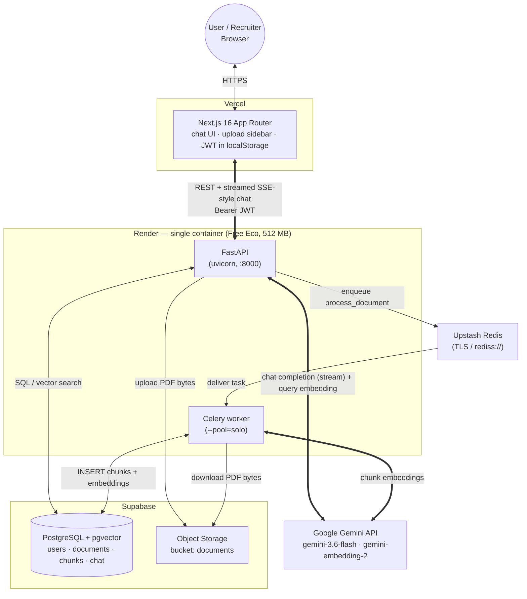
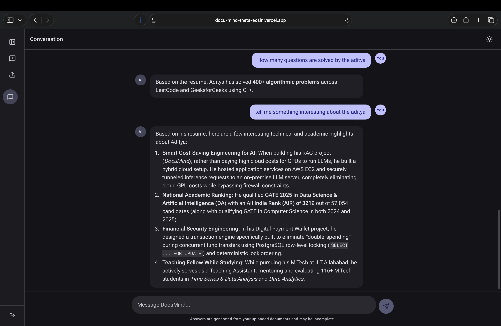
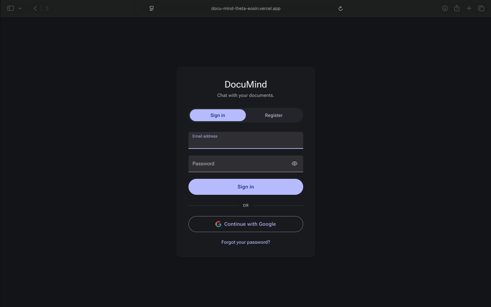

# DocuMind 🧠

DocuMind is a multi-tenant, Retrieval-Augmented Generation (RAG) platform for secure
document chat. Upload personal documents (PDF / TXT), and chat with an LLM that answers
strictly from *your* knowledge base — with token-by-token streaming, per-user isolation,
and cascading data deletion.

> ### ⏱️ Recruiter Notice — Cold-Start Disclaimer
>
> The backend runs on **Render's free tier**, which **spins the server down after a period
> of inactivity**. If the app hasn't been used recently, the **first request (login or
> chat) can take ~45–60 seconds** while the container wakes up. Subsequent requests are
> fast. This is a cost trade-off for a portfolio deployment, not an architectural limit —
> a paid instance (or Render's "always-on" setting) removes the cold start entirely.

---

## Architecture Overview

DocuMind is a **hybrid-cloud** deployment: a static frontend on Vercel's edge network, a
single always-consistent backend container on Render, and managed data services on
Supabase and Upstash. There are **no self-hosted stateful services** — the database,
object storage, and message broker are all managed free tiers.



### Request flows

**Document ingestion** — `POST /document/upload` → API streams the file bytes straight
into the Supabase Storage `documents` bucket and writes a `documents` row → enqueues a
Celery task on Upstash Redis → the worker downloads the bytes into memory, extracts text
with `PyPDF2`, splits it (LangChain `RecursiveCharacterTextSplitter`, 1000 / 100), calls
**Gemini `gemini-embedding-2`** for a 768-dim vector per chunk, and bulk-inserts into
`document_chunks` (pgvector). Document status transitions `uploaded → processing →
completed`.

**Chat & retrieval** — `POST /chat/chat` → API embeds the query (Gemini), runs a
`pgvector` cosine-distance (`<=>`) search over *that user's* chunks, assembles the top-k
context + chat history, and streams the **`gemini-3.6-flash`** response back to the
browser chunk-by-chunk (`ReadableStream`). The new session id is returned in the
`X-Session-ID` header; the assistant message is persisted on stream completion.

### Why one container?

The API and the Celery worker share the same codebase and dependencies and are both
lightweight (idle ≈ 190 MB combined). Running them as **one Render service** via
[`start.sh`](start.sh) (worker backgrounded with `--pool=solo`, uvicorn foreground,
signal-trapped graceful shutdown) fits the free tier's one-service / 512 MB limit while
keeping true async processing.

---

## Tech Stack

| Layer | Technology |
| --- | --- |
| **Frontend** | Next.js 16 (App Router), TypeScript, Tailwind CSS v4 — deployed on **Vercel** |
| **Backend API & Async Worker** | **FastAPI & Celery** running in a **unified Docker container** on **Render (Free Tier)** |
| **Message Broker** | **Upstash Redis** over **TLS** (`rediss://`) — Celery broker + result backend |
| **Database & Storage** | **Supabase PostgreSQL** with the **`pgvector`** extension, and **Supabase Object Storage** (`documents` bucket) |
| **LLM / Embeddings** | **Google Gemini API** — `gemini-3.6-flash` (chat), `gemini-embedding-2` (768-dim embeddings), via the `google-genai` SDK |
| **Auth** | JWT (`python-jose`) + bcrypt password hashing; strict `user_id` scoping on every query |
| **CI** | GitHub Actions — pytest against a `pgvector` service container on every push / PR |

> `ui/` holds the original Streamlit prototype, kept only for reference. `frontend/` is the current UI.

---

## Features

* **Multi-tenant security** — JWT auth, bcrypt hashing; every document/chat query is filtered by `user_id`.
* **Cascading deletion** — deleting your account purges all documents, vector embeddings, chat sessions, and the underlying Storage objects.
* **Real-time streaming** — token-by-token chat responses with graceful mid-stream stop.
* **Markdown answers** — assistant messages render Markdown (headings, bold, lists, code, tables) via `react-markdown`.
* **Semantic search** — `pgvector` cosine similarity over document chunks.
* **Async ingestion** — PDF parsing + embedding runs off the request path on the Celery worker.

---

## Configuration

**Backend** — copy [`.env.example`](.env.example) to `.env`:

| Variable | Purpose |
| --- | --- |
| `DATABASE_URL` | Supabase Postgres connection string (pooled / port 6543) |
| `REDIS_URL` | Upstash Redis URL (`rediss://…`) — broker + backend |
| `SUPABASE_URL` / `SUPABASE_SERVICE_ROLE_KEY` | Supabase project + service-role key for Storage |
| `GEMINI_API_KEY` | Google AI Studio API key |
| `CHAT_MODEL` / `EMBEDDING_MODEL` | `gemini-3.6-flash` / `gemini-embedding-2` |
| `SECRET_KEY` | JWT signing key |
| `FRONTEND_ORIGINS` | CORS allow-list — set to the Vercel URL (`*` for local dev only) |

**Frontend** — `frontend/.env.local`:

| Variable | Purpose | Default |
| --- | --- | --- |
| `NEXT_PUBLIC_API_URL` | Base URL of the deployed FastAPI backend | `http://localhost:8000` |

`.env` and `.env*.local` are git-ignored; only the `.example` templates are committed.

---

## Running locally

```bash
# 0. Managed services: create a Supabase project (run scripts/init_db.sql),
#    an Upstash Redis database, and a Gemini API key. Fill in .env.
python scripts/init_db.py        # or paste scripts/init_db.sql into the Supabase SQL editor
python scripts/verify_infra.py   # sanity-check Postgres + Storage + Redis

# 1. Backend — unified container (API + worker)
docker build -t documind .
docker run --rm -p 8000:8000 --env-file .env documind

# 2. Frontend
cd frontend
npm install
npm run dev                      # http://localhost:3000
```

`docker compose up` still works for an all-local stack if you prefer separate services.

---

## Deployment

| Component | Where | How |
| --- | --- | --- |
| Frontend | Vercel | Import `frontend/` as the project root; set `NEXT_PUBLIC_API_URL` to the Render URL |
| Backend | Render | Blueprint / Docker service from repo root — builds [`Dockerfile`](Dockerfile), runs [`start.sh`](start.sh) |
| DB / Storage | Supabase | `scripts/init_db.sql` creates the schema + `pgvector` |
| Broker | Upstash | Redis database; copy the `rediss://` URL into `REDIS_URL` |

---

## Screenshots

*(Replace the placeholder links with real screenshots.)*

### 1. Chat Interface


### 2. Knowledge Base & Uploads


### 3. Login / Registration

